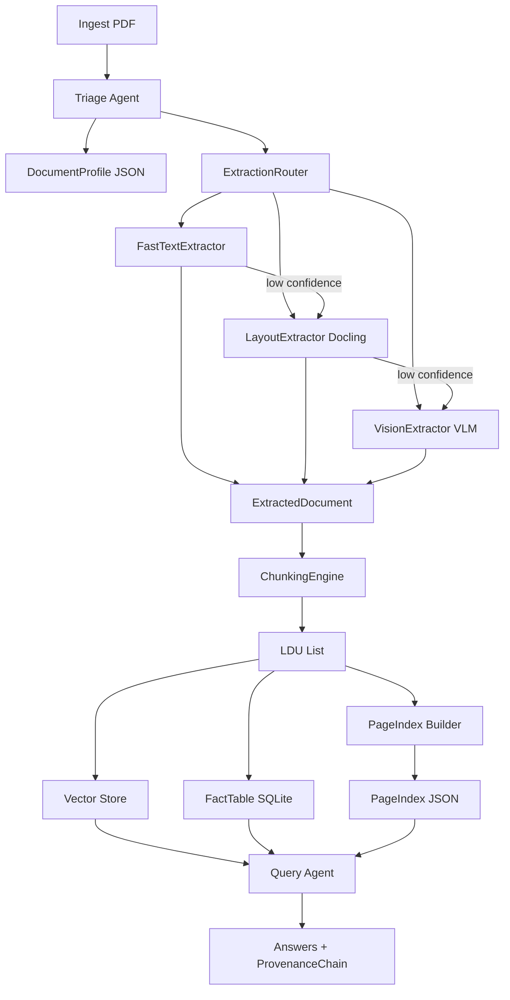

# Domain Notes — Document Intelligence Refinery (Phase 0)

Document science primer for the Refinery pipeline: extraction strategy decisions, failure modes, and pipeline architecture. These notes ground implementation choices in domain understanding rather than copy-paste.

---

## 1. Document Science Basics

### Native PDF vs Scanned PDF

- **Native digital PDF**: Contains an embedded character stream (text layer). Tools like pdfplumber and pymupdf read character positions, fonts, and bounding boxes directly. No OCR required. Layout can still be complex (multi-column, tables).
- **Scanned PDF**: Each page is one or more images. There is no character stream. Any text must be obtained via OCR (Tesseract, Docling OCR, or a Vision Language Model). Character density from pdfplumber will be near zero; image area ratio will be high.
- **Mixed**: Some pages native, some scanned (e.g., appendices). Requires per-page strategy selection and possibly escalation.

### Why This Matters for the Pipeline

- **Strategy A (Fast Text)** assumes a usable character stream. It is cheap and fast but fails silently on scanned pages (empty or garbage output).
- **Strategy B (Layout-aware)** uses layout models (e.g., Docling) that can still work on native PDFs with complex layout; some setups also support OCR for scanned pages.
- **Strategy C (Vision)** sends page images to a VLM. It works for scanned and complex pages but is expensive. We use it only when A/B are insufficient.

So the first decision is: *Does this document (or page) have a reliable character stream and simple enough layout for fast extraction, or do we need layout models or vision?*

---

## 2. Extraction Strategy Decision Tree

The following tree is used by the Triage Agent and ExtractionRouter to choose strategy and to escalate when confidence is low.

```
                    [Document Ingested]
                            |
                            v
              +-------------+-------------+
              |  Origin type?              |
              +-------------+-------------+
                |           |           |
        native_digital  scanned_image  mixed / form_fillable
                |           |           |
                v           v           v
        Layout complexity?  ----------> Strategy C (Vision)
        single_column?          (no char stream)
                |
     +----------+----------+
     |                     |
   YES                    NO
     |                     |
     v                     v
  Strategy A           Strategy B
  (Fast Text)          (Layout / Docling)
     |
     v
  Confidence gate
  (char density, image ratio,
   font metadata, table completeness)
     |
  +---+---+
  |       |
 HIGH    LOW --> escalate to Strategy B, then C if needed
  |       |
  v       v
 Keep   Retry with B/C
 A
```

### Decision Rules (to be tuned in extraction_rules.yaml)

| Condition | Strategy | Rationale |
|-----------|----------|-----------|
| `origin_type == scanned_image` | C (Vision) | No character stream; OCR or VLM required. |
| `origin_type == mixed` | B or C | Per-page or conservative: start with B, escalate to C for low-confidence pages. |
| `origin_type == native_digital` and `layout_complexity == single_column` | A, with confidence gate | Fast path when layout is simple and text is abundant. |
| `layout_complexity` in `multi_column`, `table_heavy`, `figure_heavy`, `mixed` | B (Layout) | Preserve reading order, tables, and figures. |
| Strategy A used but confidence &lt; threshold | Escalate to B | Avoid passing low-quality extraction downstream. |
| Strategy B used but confidence &lt; threshold | Escalate to C | e.g. damaged or unusual layout. |

### Suggested Thresholds (empirically tune using phase0_pdfplumber_analysis.json)

- **Character count per page**: &lt; 100 → treat as low text (likely scanned or image-heavy); do not use Strategy A for that page.
- **Character density** (chars per 1000 pt²): Below a chosen floor (e.g. &lt; 0.5) → low confidence for Strategy A.
- **Image area ratio**: &gt; 0.5 (images &gt; 50% of page area) → likely image-dominated; prefer B or C.
- **Font metadata**: Absence of font info on a “native” page can indicate a reconstructed or flattened PDF; lower confidence for A.

These are externalized in [rubric/extraction_rules.yaml](rubric/extraction_rules.yaml); refine after running `scripts/phase0_pdfplumber_analysis.py` on the full corpus.

---

## 3. Failure Modes Observed by Document Class

The target corpus has four document classes. Below are the expected failure modes and how the pipeline addresses them.

### Class A: Annual Financial Report (e.g. CBE ANNUAL REPORT 2023-24.pdf)

- **Traits**: Native digital, multi-column, embedded financial tables, footnotes, cross-references.
- **Failure modes**: (1) Structure collapse if we use naive text dump—tables become run-on text. (2) Context poverty if we chunk by token count and split a table across chunks. (3) Wrong reading order in multi-column regions.
- **Mitigation**: Prefer Strategy B (layout-aware). Chunking must keep table rows with headers; PageIndex for section-level navigation; provenance with bbox for audit.

### Class B: Scanned Government/Legal (e.g. Audit Report - 2023.pdf)

- **Traits**: Image-based; no character stream. May contain handwriting or stamps.
- **Failure modes**: (1) Strategy A returns empty or nonsense. (2) Basic OCR may misread numbers and legal terms. (3) Layout detection on scanned images is harder.
- **Mitigation**: Use Strategy C (VLM) or Docling with OCR. Do not use Strategy A. Budget guard for VLM cost; log confidence and cost in extraction_ledger.

### Class C: Technical Assessment Report (e.g. fta_performance_survey_final_report_2022.pdf)

- **Traits**: Mixed layout—narrative, embedded tables, hierarchical sections, assessment findings.
- **Failure modes**: (1) Section boundaries lost in flat extraction. (2) “See Table X” cross-references broken if chunking severs reference from target. (3) Lists or numbered findings split across chunks.
- **Mitigation**: Strategy B for structure; chunking rules: section headers as parent metadata, cross-references resolved and stored as chunk relationships; numbered lists kept as single LDU when possible.

### Class D: Structured Data Report / Tax Expenditure (e.g. tax_expenditure_ethiopia_2021_22.pdf)

- **Traits**: Table-heavy, numerical, fiscal categories, multi-year data.
- **Failure modes**: (1) Table extraction fidelity—wrong alignment, merged cells, misread numbers. (2) Numerical precision loss. (3) Hierarchical headers (e.g. category sub-rows) flattened.
- **Mitigation**: Strategy B (or C if layout is poor) with explicit table schema; FactTable extractor for key-value and row-level facts; provenance so every number can be traced to page and bbox.

---

## 4. Pipeline Diagram (Refinery Architecture)

End-to-end flow from ingest to queryable, auditable output:



### Stage Summary

1. **Triage Agent**: Classifies origin type, layout complexity, domain hint, language; writes DocumentProfile; determines initial extraction cost tier.
2. **ExtractionRouter**: Selects Strategy A/B/C from profile; runs chosen extractor; applies confidence gate and escalation (A→B→C).
3. **Structure Extraction**: Produces a normalized ExtractedDocument (text blocks, tables, figures, bboxes, reading order).
4. **ChunkingEngine**: Converts ExtractedDocument into LDUs respecting the five chunking rules; ChunkValidator enforces rules; content_hash for provenance.
5. **PageIndex Builder**: Builds hierarchical section tree with summaries and key entities; supports “navigate then retrieve” instead of blind vector search.
6. **Query Agent**: Uses pageindex_navigate, semantic_search, structured_query; every answer includes ProvenanceChain (document, page, bbox, content_hash). Audit mode verifies claims against sources.

---

## 5. Tooling Landscape (Summary)

- **pdfplumber**: Character-level access, bboxes, images; used for fast extraction and for triage metrics (density, image ratio, font metadata). Does not reconstruct complex layout or tables as structure.
- **Docling**: Unified DoclingDocument; layout-aware conversion to Markdown and structured output. Can integrate OCR. We normalize its output to our ExtractedDocument schema via an adapter. API: `DocumentConverter().convert(path).document` yields a Docling document with `export_to_markdown()`, `export_to_dict()`, and typically `.tables` / `.pictures` for structured elements; see [Docling architecture](https://docling-project.github.io/docling/concepts/architecture/). Phase 2 will implement a DoclingDocumentAdapter mapping this to our ExtractedDocument (text blocks, tables, figures, bboxes).
- **MinerU**: Multi-stage pipeline (layout → tables → formulas → Markdown/JSON). We use its architecture as reference; implementation may use Docling first, with MinerU as an alternative backend if needed.
- **VLM (OpenRouter)**: For scanned or low-confidence pages; budget guard and cost logging required.

---

## 6. Phase 0 Artifacts

- **scripts/phase0_pdfplumber_analysis.py**: Runs character density, image ratio, and font-metadata analysis on all PDFs in `data/`. Output: `.refinery/phase0_pdfplumber_analysis.json`. Use this to set numerical thresholds in `extraction_rules.yaml`.
- **scripts/phase0_docling_sample.py**: Runs Docling on corpus PDFs (native first; use `--max-docs 1` for a quick run). Writes to `.refinery/phase0_docling_sample.json`. Use to validate Docling output shape and plan the DoclingDocumentAdapter in Phase 2.
- **[rubric/extraction_rules.yaml](rubric/extraction_rules.yaml)**: Triage thresholds (scanned vs native, fast-text gates) and chunking rules. Phase 1–2 read this; new document types are onboarded here.

After running these scripts, update the “Suggested Thresholds” in Section 2 with empirical values from your corpus and document any Docling-specific findings below.

---

## 7. Empirical Notes (from Phase 0 scripts)

- **From phase0_pdfplumber_analysis.json**: Class B (Audit Report): avg char_density 0.0022, image_ratio 0.99, 94/95 low-text pages — use Strategy C. Classes A/C/D: char_density 2.85–3.39, image_ratio ≤0.11 — Strategy A/B viable. Thresholds: scanned when image_ratio &gt; 0.5 or majority pages char_count &lt; 100; Strategy A when char_density &gt; 0.5, image_ratio &lt; 0.5, has_font_metadata.)
- **From phase0_docling_sample.json**: Docling uses RapidOCR (downloads models on first run). In this environment, both the scanned Audit Report and native multi-page PDFs (e.g. CBE Annual Report) hit `std::bad_alloc` during preprocess (from ~page 13 onward), indicating memory pressure. For Phase 2: (1) build the DoclingDocumentAdapter using Docling’s documented API (`export_to_markdown()`, `export_to_dict()`, `.tables`, `.pictures`); (2) consider processing large documents in smaller page batches or on a machine with higher RAM; (3) use Strategy C (VLM) for very large scanned documents when Docling is not viable.
