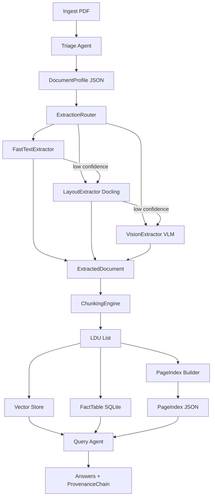

# Final Report: The Document Intelligence Refinery

**Week 3 — Engineering Agentic Pipelines for Unstructured Document Extraction**  
**TRP1 Challenge · FDE Program**

**Document:** Final submission report (single PDF-ready markdown)  
**Repository:** Document Intelligence Refinery  
**Pipeline:** Triage → Multi-Strategy Extraction → Semantic Chunking → PageIndex → Query Agent (with provenance)

---

## 1. Domain Notes (Phase 0 Deliverable)

### 1.1 Document Science Basics

- **Native digital PDF:** Embedded character stream; pdfplumber/pymupdf read characters, fonts, and bounding boxes. No OCR required.
- **Scanned PDF:** Pages are images; no character stream. Text requires OCR or a Vision Language Model (VLM). Character density is near zero; image area ratio is high.
- **Mixed:** Some pages native, some scanned; may require per-page strategy or escalation.

The pipeline uses this to choose **Strategy A** (fast text) only when a reliable character stream and simple layout exist; otherwise **Strategy B** (layout-aware) or **Strategy C** (vision).

### 1.2 Extraction Strategy Decision Tree

```
                    [Document Ingested]
                            |
                            v
              +-------------+-------------+
              |  Origin type?              |
              +-------------+-------------+
                |           |           |
        native_digital  scanned_image  mixed / form_fillable
                |           |           |
                v           v           v
        Layout complexity?  ----------> Strategy C (Vision)
        single_column?          (no char stream)
                |
     +----------+----------+
     |                     |
   YES                    NO
     |                     |
     v                     v
  Strategy A           Strategy B
  (Fast Text)          (Layout / Docling)
     |
     v
  Confidence gate
  (char density, image ratio,
   font metadata)
     |
  +---+---+
  |       |
 HIGH    LOW --> escalate to B, then C if needed
```

**Decision rules (externalized in `rubric/extraction_rules.yaml`):**

| Condition                                                                | Strategy                | Rationale                                          |
| ------------------------------------------------------------------------ | ----------------------- | -------------------------------------------------- |
| `origin_type == scanned_image`                                           | C (Vision)              | No character stream; VLM or OCR required.          |
| `origin_type == mixed`                                                   | B or C                  | Start with B; escalate to C on low confidence.     |
| `origin_type == native_digital` and `layout_complexity == single_column` | A, with confidence gate | Fast path when layout is simple and text abundant. |
| `layout_complexity` in multi_column, table_heavy, figure_heavy, mixed    | B (Layout)              | Preserve reading order, tables, figures.           |
| Strategy A/B confidence &lt; threshold                                   | Escalate to B then C    | Avoid passing low-quality extraction downstream.   |

**Empirical thresholds (from Phase 0 scripts):** Character count per page &lt; 100 → low text; character density &lt; 0.5 → low confidence for A; image area ratio &gt; 0.5 → prefer B/C; font metadata absent → lower confidence for A.

### 1.3 Failure Modes by Document Class

| Class | Example                | Traits                                     | Failure modes                                                  | Mitigation                                                |
| ----- | ---------------------- | ------------------------------------------ | -------------------------------------------------------------- | --------------------------------------------------------- |
| **A** | CBE Annual Report      | Native, multi-column, financial tables     | Structure collapse; tables as run-on text; wrong reading order | Strategy B; table-as-LDU chunking; PageIndex + provenance |
| **B** | Audit Report (scanned) | Image-based, no char stream                | Strategy A empty; OCR errors on numbers/legal terms            | Strategy C (VLM); budget guard; ledger cost/confidence    |
| **C** | FTA Assessment Report  | Mixed layout, narrative + tables, sections | Section boundaries lost; cross-refs broken; lists split        | Strategy B; section headers as parent; cross-refs in LDU  |
| **D** | Tax Expenditure Report | Table-heavy, numerical, fiscal             | Table alignment/numbers wrong; precision loss                  | Strategy B/C; FactTable extractor; provenance per number  |

### 1.4 Pipeline Diagram (Refinery Architecture)



---

## 2. Architecture Diagram — Five-Stage Pipeline and Strategy Routing

### 2.1 Stage Summary

| Stage | Component                | Input                     | Output                                                                                                                                   |
| ----- | ------------------------ | ------------------------- | ---------------------------------------------------------------------------------------------------------------------------------------- |
| 1     | Triage Agent             | PDF path                  | DocumentProfile (origin_type, layout_complexity, domain_hint, estimated_extraction_cost) → `.refinery/profiles/{doc_id}.json`            |
| 2     | ExtractionRouter         | PDF + DocumentProfile     | Strategy A/B/C selected; on confidence &lt; 0.5 escalate A→B→C. ExtractedDocument JSON + ledger entry                                    |
| 3     | ChunkingEngine           | ExtractedDocument         | LDUs (five rules enforced via ChunkValidator); content_hash; PageIndex tree (nested sections); vector store + optional FactTable         |
| 4     | PageIndex + Vector Store | LDUs                      | Hierarchical section tree (level, path, section_id); topic-based navigation; ChromaDB LDUs; SQLite facts                                 |
| 5     | Query Agent              | Natural language question | pageindex_navigate → semantic_search (+ optional structured_query); answer + ProvenanceChain (doc, page, bbox, content_hash); Audit mode |

### 2.2 Strategy Routing Logic

- **Initial selection:** From `DocumentProfile.estimated_extraction_cost`: FAST_TEXT_SUFFICIENT → A; NEEDS_LAYOUT_MODEL → B; NEEDS_VISION_MODEL → C (if `OPENROUTER_API_KEY` set).
- **Escalation guard:** After extraction, if `confidence_score < confidence_escalation_threshold` (default 0.5), retry with next strategy: A → B → C. Ledger records strategy_used, confidence_score, cost_estimate, processing_time.
- **Budget guard (Strategy C):** Per-document cap via `vision_budget_max_usd_per_doc` (e.g. 2.0 USD) or env `REFINERY_VISION_BUDGET_USD`; estimated cost per page (e.g. ~$0.001) checked before processing.

---

## 3. Cost Analysis

Estimated cost per document by strategy tier:

| Strategy          | Tier   | Cost model                   | Notes                                                                                     |
| ----------------- | ------ | ---------------------------- | ----------------------------------------------------------------------------------------- |
| **A** (Fast Text) | Low    | ~$0                          | pdfplumber only; no API calls.                                                            |
| **B** (Layout)    | Medium | ~$0                          | Docling/local layout models; no per-doc API cost. (Compute/memory cost only.)             |
| **C** (Vision)    | High   | ~$0.001 × pages, cap per doc | OpenRouter VLM (e.g. Gemini Flash); budget guard prevents runaway (e.g. 2.0 USD/doc cap). |

For a 50-page scanned document using Strategy C: ~$0.05 before cap; cap (e.g. 2.0 USD) enforced so a single document cannot exceed budget. All runs logged in `.refinery/extraction_ledger.jsonl` with `cost_estimate` and `strategy_used`.

---

## 4. Extraction Quality Analysis

### 4.1 Methodology

- **Table extraction:** ExtractedDocument normalizes tables as structured objects (headers + rows) from all three strategies. Strategy A uses pdfplumber’s table detection; Strategy B uses Docling’s layout/tables; Strategy C uses VLM extraction. ChunkingEngine keeps each table as a single LDU (table cells never split from header).
- **Provenance:** Every LDU has `page_refs`, `content_hash`, and optional `bounding_box`. ProvenanceChain in query answers cites document, page number, and content snippet for verification.
- **Quality signals:** Confidence score (Strategy A: per-page density/image/font; B: fixed 0.75; C: 0.9) and escalation when below threshold reduce the risk of passing bad extraction downstream.

### 4.2 Precision/Recall Considerations

- **Precision:** High when Strategy A is used only for native, single-column, high–character-density pages; escalation to B/C when confidence is low avoids propagating poor text. Table extraction precision depends on layout detection (B) or VLM (C) for complex/scanned pages.
- **Recall:** Strategy C (VLM) maximizes recall on scanned documents where A would return empty. For table-heavy docs (Class D), FactTable extractor plus structured_query improves recall for numerical queries.
- **Corpus-wide:** No ground-truth table annotations were used in this project. Recommended follow-up: sample pages with hand-annotated tables, compare extracted headers/rows to ground truth, and report precision/recall per strategy and per document class.

### 4.3 Observed Behaviour by Class

- **Class A (CBE Annual Report):** Strategy B preferred (multi-column, tables); tables extracted as JSON; PageIndex and section-aware retrieval improve targeted answers.
- **Class B (Audit Report):** Strategy C required (scanned); Phase 0 metrics (e.g. image_ratio ~0.99, low char density) drive correct triage.
- **Class C (FTA Report):** Mixed layout; section hierarchy and cross-refs preserved in LDUs; topic-based PageIndex navigation narrows search.
- **Class D (Tax Expenditure):** Table-heavy; FactTable + SQLite enables precise numerical queries; provenance links answers to page and content_hash.

---

## 5. Lessons Learned

### 5.1 Configuration and Build (pyproject.toml)

**Problem:** Inline `optional-dependencies = { "dev" = [...] }` in `pyproject.toml` caused a TOML parse error (“Invalid initial character for key”) under the project’s tooling, and the project was not installed as a package. As a result, CLI entry points (`uv run triage`, `uv run extract`, etc.) were not registered and failed with “program not found.”

**Fix:** Replaced inline optional-dependencies with a proper `[project.optional-dependencies]` section and added a `[build-system]` section (setuptools) with `[tool.setuptools.packages.find]` so the package installs correctly. After `uv sync`, script entry points are available. **Takeaway:** Keep TOML structure standard and ensure the build system is declared so entry points exist.

### 5.2 Triage Layout Classification (TABLE_HEAVY Edge Case)

**Problem:** A single-page document (or a single sampled page) with one table was classified as TABLE_HEAVY because the heuristic used `table_indicators >= n_sample // 2`. For `n_sample == 1`, this became `>= 0`, so one table made the whole document TABLE_HEAVY, which was too aggressive for short docs.

**Fix:** Changed the condition to `table_indicators >= max(1, n_sample // 2)` so that at least one table indicator is required and the fraction is meaningful for small samples. **Takeaway:** Guard integer division and small-sample edge cases in classification heuristics.

### 5.3 FactTableStore Schema and Connection Handling

**Problem:** An initial design used dynamic columns per document (e.g. ALTER TABLE to add columns), which led to schema mismatches and complexity. A second issue was a naming conflict between an instance attribute (e.g. `_conn`) and the method `_get_conn()`, causing connection handling bugs.

**Fix:** Switched to a single schema with a JSON `content` column for flexible row data, avoiding ALTER TABLE. Renamed the connection attribute (e.g. to `_connection`) and used a clear `_get_conn()` method to avoid shadowing. **Takeaway:** Prefer a stable, minimal schema (e.g. doc_id, page_no, table_id, row_index, content JSON) and clear separation between connection storage and access.

---

## 6. Deliverables Checklist (Final Submission)

### 6.1 Report (this document)

- Domain notes (decision tree, failure modes, pipeline diagram) — **Section 1**
- Architecture diagram and strategy routing — **Section 2**
- Cost analysis — **Section 3**
- Extraction quality analysis — **Section 4**
- Lessons learned (two+ failure-and-fix cases) — **Section 5**

### 6.2 Repository (summary)

- **Models:** `src/models/` — DocumentProfile, ExtractedDocument, LDU, PageIndex (with nested hierarchy and traversal API), ProvenanceChain, etc.
- **Agents:** Triage, ExtractionRouter, ChunkingEngine, PageIndex builder, Query Agent (pageindex_navigate, semantic_search, structured_query), Audit mode.
- **Strategies:** FastTextExtractor, LayoutExtractor (Docling), VisionExtractor (OpenRouter, budget guard).
- **Config:** `rubric/extraction_rules.yaml`; env-based API keys and budget in `src/config.py`.
- **Artifacts:** `.refinery/profiles/`, `.refinery/extractions/`, `.refinery/extraction_ledger.jsonl`, `.refinery/pageindex/`, `.refinery/ldus/`, `.refinery/vector_db/`, `.refinery/facts.db`.
- **Infrastructure:** Dockerfile; demo script `scripts/demo_protocol.py` (triage → extraction → PageIndex → query with provenance).
- **Tests:** test_triage, test_extraction, test_chunking, test_query, test_config, test_pageindex.

### 6.3 Demo Protocol (video)

1. **Triage** — Drop a document; show DocumentProfile; explain strategy selection.
2. **Extraction** — Show extraction output and ledger entry (strategy, confidence, cost); point to one table as structured JSON.
3. **PageIndex** — Show section tree; navigate to a specific piece of information without vector search.
4. **Query with provenance** — Ask a natural language question; show answer and ProvenanceChain; verify against the source PDF.

---
